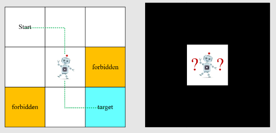

# Lecture 1: Basic Concepts in Reinforcement Learning

- 从网格世界的例子展开
    - 给每个网格会限定类型：Accessible(可以行走的白色方格)/forbidden(禁止去行走)/target(目标区域)/boundary(网格边界)
    - 只能上下左右移动，无法斜着走
    - 任务：
        - 找到一条“最佳”的路通往目标区域
        - “最佳”如何去定义，在前往目标区域的过程中我们要尽可能避开被禁止，走弯路和边界这三种情况。

- State: 智能体在环境中的地位/状态。
    - 在网格世界的例子中，机器人就是一个agent(智能体)，其所处网格的位置就是其state，对于3×3大小的网格而言，可能的state一共有9个，分别是 $s_1,s_2,...,s_9$ (注：每个s的维度要根据其实际大小来确定)
    - State space是所有state的集合, $S = \{s_i\}^{9}_{i=1}$

- Action: 针对每个state，会有五个可能的action，看图说话， $a_5$表示的是原地不动。
- Action Space of a state: 每一个状态对应的所有action组成的集合， $A\{s_i\}=\{a_i\}^5_{i=1}$

- State transition: 智能体采取一次Action之后，自身的状态会从一个state到另一个state。例如： $s_1 \stackrel{a_2}{\longrightarrow} s_2$

- Forbidden area可以分成两种情况，一种是accessible（可进入但会受到惩罚），第二种是无法进入。虽然选择第一种方式后系统会变得更加复杂，但是智能体通过accessible forbidden area可能可以更快的到达的target，所以我们针对这种情况进行展开讨论。
- State transition可以通过表格的形式进行展现：

- 上述State transition存在的问题是：每一个state跳转后得到的state是确定的，这不符合实际情况，一个state跳转后的state可能是多样的，所以我们采用State transition probability来描述跳转过程，其实就是一个条件概率，如：
    - $p(s_2|s_1,a_2)=1$
    - $p(s_i|s_1,a_2)=0 \space \space \space \space \forall i \neq 2$
- Policy( $\pi$): 告诉智能体在当前state应该采取什么样的action。下图是一个确定性Policy的表达，即在 $s_1$一定采取 $a_2$，这只是一个特殊情况，Policy可能是不确定的。

- Policy也可以用表格的形式进行呈现。

- Reward：通过采取action我们获得的一个真实值
    - 如果reward是一个正值，表示鼓励(encouragement)这个action
    - 如果reward是一个负值，表示惩罚(punishment)这个action
    - 零值表示没有惩罚，从某种意义上来说是鼓励
    - 当然也可以把不同值表示的意义调换，那么我们的目标也随之调换。
    - 举例:
        - 如果智能体有要跳出边界的action，让 $r_{bound} = -1$
        - 如果智能体进入了一个被禁止的网格，让 $r_{forbid}=-1$
        - 如果智能体到达了target网格，让 $r_{target}=+1$
        - 除此之外，智能体获得的reward均为0
    - reward依赖的当前的state和action，而不是下一个state。因为存在下一个state相同，但到达下一个state的action不同，比如如果有一种情况是物体企图越过边界，但被反弹回来，另一种是原地不动。那么两者的下一个state虽然都是在原地，但前者我们需要去惩罚。
- trajectory：是一个state-action-reward组成的链。

- return是一个trajectory中所有rewards的加和，比如下面这个链的return = 0 + 0 + 0 + 1 = 1
- discount return出现为了解决return 存在的发散问题(当到达target后，如果物体一直在原地不动，那么他将一直获得reward，使得最终reward变得无穷大)。$\gamma$ 是discount rate，用来平衡reward。
    - 引入discount rate，让reward的总和变得有限。
    - 如果 $\gamma$接近于0，discount return的取值集中在前几步，重点在于相对较近的未来。
    - 如果 $\gamma$接近于1，discount return的取值集中在一个长远的步骤，重点在于相对较远的未来。

$$
discounted\space return = 0 + \gamma0 + \gamma^20+...=\gamma^3(1+\gamma+\gamma^2+...)=\gamma^3 \frac{1}{1-\gamma}
$$

- Episode：一个有限步数的trajectory被成为Episode。简单来讲，一个有terminal states的任务可以被成为Episode tasks。没有terminal states的任务是Continuing tasks。
- Markov decision process(MDP)
    - 这里直接放课件原图了，很全面
    - 老师最后的讲述非常的nice，如果有人问你MDP到底是什么，你可以用MDP对应的三个单词来分别解释，Markov就是Markov property，也即memoryless property。decision就是Policy，我们用什么策略决定下一步的走向。Process表述的是整个set的形成(Sets)和不同状态之间的转移过程(Probability distribution)。

