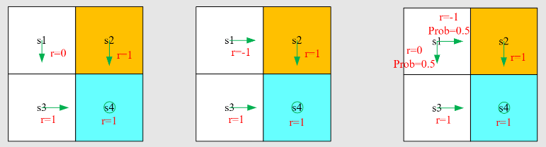

# Lecture 2: Bellman Equation

## Part 1: Motivating example - why is return important?

- 回顾：什么是return？return是一条trajectory上所有rewards进行discounted(折扣化)后的总和。
- return的重要性：从同一起始点出发，策略不同，得到的rewards也会不同，我们需要return去衡量从起始点到target路径上一系列策略的好坏。（下图直观的去观察会觉得图一的策略比较好，因为目标物体没有进入forbidden区域）

- 如上图，如果我们按照策略一，我们得到的return将会是 (下面的 $return$ 都是 $discounted \space return$)

$$
return_1=0+\gamma1+\gamma^21+...,=\gamma(1+\gamma+\gamma^2+...)=\frac{\gamma}{1-\gamma}
$$

- 策略二：

$$
return_2 = -1+\gamma1+\gamma^21+...,=\frac{2\gamma-1}{1-\gamma}
$$

- 策略三：

$$
return_3=0.5return_1+0.5return_2=\frac{3\gamma-1}{2(1-\gamma)}
$$

- $return_1>return_3>return_2$ 这和我们的直觉是类似的，第一种策略显然更好，所以 $return$ 可以建立起直觉和实际情况的纽带。

## Part 2: Motivating example - How to calculate return?

- 假设我们用 $v_i$ (state value)表示从 $s_i$ 出发所获取的总的 $return$
    - 定义法：
        - $v_1 = r_1+\gamma r_2+\gamma^2 r_3+...$
        - $v_2 = r_2+\gamma r_3+\gamma^2 r_4+...$
        - $v_3 = r_3+\gamma r_4+\gamma^2 r_1+...$
        - $v_4 = r_4+\gamma r_1+\gamma^2 r_2+...$
    - 将定义法变换一种形式, 从某一状态出发的得到的 $return$ 依赖于其它状态得到的 $return$ (被称为Bootstrapping)
        - $v_1=r_1+\gamma(r_2+\gamma r_3+...)=r_1+\gamma v_2$
        - $v_2=r_2+\gamma v_3$
        - $v_3 = r_3+\gamma v_4$
        - $v_4=r_4+\gamma v_1$

- 贝尔曼公式
    - 根据上面的式子，我们可以得到
    
    $$
    \underbrace{\left[\begin{array}{c}v_{1} \\v_{2} \\v_{3} \\v_{4}\end{array}\right]}_{\mathbf{v}}=\left[\begin{array}{c}r_{1} \\r_{2} \\r_{3} \\r_{4}\end{array}\right]+\left[\begin{array}{c}\gamma v_{2} \\\gamma v_{3} \\\gamma v_{4} \\\gamma v_{1}\end{array}\right]=\underbrace{\left[\begin{array}{c}r_{1} \\r_{2} \\r_{3} \\r_{4}\end{array}\right]}_{\mathbf{r}}+\gamma \underbrace{\left[\begin{array}{cccc}0 & 1 & 0 & 0 \\0 & 0 & 1 & 0 \\0 & 0 & 0 & 1 \\1 & 0 & 0 & 0\end{array}\right]}_{\mathbf{P}} \underbrace{\left[\begin{array}{c}v_{1} \\v_{2} \\v_{3} \\v_{4}\end{array}\right]}_{\mathbf{v}}
    $$
    
    - 贝尔曼公式（针对deterministic的情况）： $\mathbf{v}=\mathbf{r}+\gamma \mathbf{P} \mathbf{v}$
- 举例：
    - 如下图所示，列出了从某个state出发得到的value，接下来需要通过转化为行阶梯型矩阵和回代的方法解决这个线性方程组（比较正式的方法，也可以直接从 $v_4$ 的式子出发直接求解析解）。

## Part3: State value

- 一些概念

这里最开始我有个不理解的地方， $S_t$ 和 $A_t$已知的情况下跳转到 $S_{t+1}$ 的时候，如果state probability确定的话，那么reward不也是确定的吗？为什么还要把state probability和reward probability分开呢？我仔细去查了一下发现，原来 $R_{t+1}$ 指的奖励的分布，即获取的奖励大小可能是随机的。比如你在玩大富翁的时候，state probability是随机的，因为你要靠掷色子决定你走几步。而reward也是随机的，因为你不知道你走到的是地皮/监狱/起点/奖励卡等等，所以reward probability确实和state probability不一样，并非同一个概念，一者不能决定另一者。

- 针对多步的trajectory，我们可以用一个总的discounted return来表示（注意， 这里的 $G_t$是随机变量）：

$$
G_t=R_{t+1}+\gamma R_{t+2} + \gamma^2R_{t+3} +...+
$$

- state value是 $G_t$ 的期望，也可以说是平均，因为其是一个随机变量，通过不一样的trajectory，就可以得到不一样的 $G_t$， $v_\pi(s)=E[G_t|S_t=s]$
    - state value是一个关于s的函数，其的取值取决于起始状态s
    - state value基于策略 $\pi$ ，不同的策略 ，state value可能不同，对应不同的trajectory
    - discounted return 和 state value之间的关系：从同一起始点出发，如果trajectory是deterministic的，那么二者的值是一致的。但如果有多个trajectory，那么两者就会有区别。
- state value的计算例子：第一个和第二个例子都是deterministic的trajectory，第三个是multi-trajectory的例子。

## Part 4: Bellman equation - Derivation

- $G_t=R_{t+1}+\gamma R_{t+2}+\gamma^2R_{t+3}+...,=R_{t+1}+\gamma G_{t+1}$
- $v_\pi(s)=E[G_t|S_t=s]=E[R_{t+1}+\gamma G_{t+1}|S_t=s]=E[R_{t+1}|S_t=s]+\gamma E[G_{t+1}|S_t=s]$
- $E[R_{t+1}|S_t=s]=\sum_a \pi(a|s)E[R_{t+1}|S_t=s,A_t=a] =\sum_a \pi(a|s) \sum_r p(r|s,a)r$
    - 这里可能会懵，但是结合我之前讲的reward probability和state probability的例子就可以很清晰的理解为什么要这么分开
    - 其对应的就是immediate reward的均值
- $E[G_{t+1} | S_t = s] = \sum_{s'} E[G_{t+1} | S_t = s, S_{t+1} = s'] p(s' | s)
= \sum_{s'} E[G_{t+1} | S_{t+1} = s'] p(s' | s)
= \sum_{s'} v_{\pi}(s') p(s' | s)
= \sum_{s'} v_{\pi}(s') \sum_{a} p(s' | s, a) \pi(a | s)$
    - $S_t=s$可以舍弃凸显了MDP的memoryless的性质
    - $\sum_{a} p(s' | s, a) \pi(a | s)=p(s'|s)$可以用条件概率公式推导出来
    - 其对应的是future reward的均值
- 完整Bellman公式

- $\pi(a|s)$是给定的策略，求解Bellman公式的过程又叫 policy evaluation； $p(r|s,a)$和 $p(s'|s,a)$表示dynamic model/environment model，这个model可能是确定的可能是不确定的。
- 示例(policy is deterministic)：

- For $s_1:$
    - $\pi(a=a_3|s_1)=1\space and \space \pi(a\neq a_3|s_1)=0$
    - $p(s'=s_3|s_1,a_3)=1 \space and \space p(s'\neq s_3|s_1,a_3)=0$
    - $p(r=0|s_1,a_3)=1 \space and \space p(r \neq 0|s_1,a_3)=0$
    - 带入公式得到 $v_\pi(s_1)=0+\gamma v_\pi(s_3)$
- 以此类推可以得到方程组
    - $v_\pi(s_1)=0+\gamma v_\pi(s_3)$
    - $v_\pi(s_2)=1+\gamma v_\pi(s_4)$
    - $v_\pi(s_3)=1+\gamma v_\pi(s_4)$
    - $v_\pi(s_4)=1+\gamma v_\pi(s_4)$
- 解得
    - $v_\pi(s_4)=\frac{1}{1-\gamma}$
    - $v_\pi(s_3)=\frac{1}{1-\gamma}$
    - $v_\pi(s_2)=\frac{1}{1-\gamma}$
    - $v_\pi(s_1)=\frac{\gamma}{1-\gamma}$

我们发现，其实 $v_\pi(s_1)$的值是最小的，因为在所有的状态中， $s_1$是离target value最远的状态。

## Part 5: Bellman equation - Matrix-vector form and solution

- 观察贝尔曼公式，虽然通过该公式我们无法直接求解出 $v_\pi(s)$，但我们可以将每一个state都带入式子，就会得到每一个状态的方程式，构成一个线性方程组，被叫做 $matrix-vector$ 形式，可以利用这个形式来求解。

$$
v_\pi(s) = \sum_a \pi(a|s)[\sum_r p(r|s,a)r+\gamma\sum_{s'}p(s'|s,a)v_\pi(s')]
$$

- $v_\pi(s)=r_\pi(s)+\gamma\sum_{r'}(s'|s)v_\pi(s')$
    - $r_\pi(s)=\sum_a\pi(a|s)\sum_rp(r|s,a)r$
    - $p_\pi(s'|s)=\sum_{a}\pi(a|s)p(s'|s,a)$
- 实际情况状态是有多个的，我们需要用向量的形式来表现，比如对于有四个状态的情况，我们可以将贝尔曼公式表示为( $P_\pi$是状态转移矩阵 )：

- Policy evaluation: 给定一个policy，找出其相关的state values是非常重要的问题，用于评估一个policy的好坏。
- 贝尔曼公式的两种解决方案
    - matrix-vector形式： $v_\pi=r_\pi+\gamma P_\pi v_\pi$
    - closed-form solution(直接给出解析表达式):  $v_\pi=(I-\gamma P_\pi)^{-1}r_\pi$，当状态空间较大时，矩阵的维度将会变得很大，求逆的难度会变大，实际中经常不会使用。
    - iterative solution(实际中经常使用的迭代的方法): $v_{k+1}=r_\pi+\gamma P_\pi v_k$
        - 这里的 $k+1$ 和 $k$ 并不是表示策略，而是表示第 $k,k+1$次迭代时，状态的价值估计， $v_k,v_k+1$是一个向量，包含了所有状态的价值。
        - 关于当 $k$趋于无穷大时，$v_k$趋于 $v_\pi$, 如果不从Banach不动点定理理解，我认为直观的理解是我们需要去估计出当前策略 $\pi$ 下最符合的那个state value向量，我们可以先猜测一个state value，然后利用已知的奖励向量和状态转移矩阵去迭代，因为有折扣因子的存在，future value会不断地减小，到最后每一个状态的immediate value和future value的总和就会趋于稳定，也就得到了我们当前策略最符合的state value向量。
            - 详细证明：
                
                
                
        - 深入理解：来一个2个状态的MDP
            - 构造：
                - MDP定义：
                    - States: $s_1,s_2$
                    - Actions: $a_1,a_2$
                    - Rewards:
                        - $s_1$ 执行 $a_1$：$r(s_1,a_1)=1$，转移到 $s_2$ 的概率为 $P(s_2|s_1,a_1)=1$
                        - $s_1$ 执行 $a_2$：$r(s_1,a_2)=0$，转移到 $s_1$ 的概率为 $P(s_1|s_1,a_2)=1$
                        - $s_2$ 执行 $a_1$：$r(s_2,a_1)=2$，转移到 $s_1$ 的概率为 $P(s_1|s_2,a_1)=1$
                        - $s_2$ 执行 $a_2$：$r(s_2,a_2)=0$，转移到 $s_2$ 的概率为 $P(s_2|s_2,a_2)=1$
                    - discount: $\gamma=0.9$
                    - 策略 $\pi$
                        - 在状态 $s_1$: 总是选择 $a_1$, 即 $\pi(a_1|s_1)=1, \pi(a_2|s_1)=0$
                        - 在状态 $s_1$: 总是选择 $a_1$, 即 $\pi(a_1|s_1)=1, \pi(a_2|s_1)=0$
            - 计算 $r_\pi$ 和 $P_\pi$
                
                
                
            - 迭代计算
                
                
                
            - 真实解 $v_\pi$（用于对比）
                
                
                

## Part 6：Action value

- 放个State value和Action value的英文定义，非常清晰：
    - State value: the average return the agent can get starting from a state
    - Action value: the average return the agent can get starting from a state and taking an action
- Action value
    - 定义: $q_\pi(s,a) = E[G_t|S_t=s,A_t=a]$
        - 由于 $E[G_t|S_t=s]=\sum_a E[G_t|S_t=s,A_t=a]\pi(a|s)$
        - 可以得到 $v_\pi(s)=\sum_a\pi(a|s)q_\pi(s,a)$
        - 比较 state value的函数
        
        $$
        v_{\pi}(s)=\sum_{a} \pi(a \mid s)[\underbrace{\sum_{r} p(r \mid s, a) r+\gamma \sum_{s^{\prime}} p\left(s^{\prime} \mid s, a\right) v_{\pi}\left(s^{\prime}\right)}_{q_{\pi}(s, a)}]
        $$
        
        - 最终得到 action value的函数，通过式子可以知道如果我们知道了每个状态的state value，我们就可以知道每个状态对应的action value
        
        $$
        q_{\pi}(s, a)=\sum_{r} p(r \mid s, a) r+\gamma \sum_{s^{\prime}} p\left(s^{\prime} \mid s, a\right) v_{\pi}\left(s^{\prime}\right)
        $$
        
- 举个例子：
    
    
    
    - 写出图中针对s1的action value表达式(此处 $a_2$表示向右移动)： $q_\pi(s_1,a_2)=-1+\gamma v_\pi(s_2)$
    - 此处注意，虽然图中采用了 $a_2$策略，但并不代表在s1采取其它的action得到的action value值是0，后续我们需要根据不同的action value值进行策略改进。